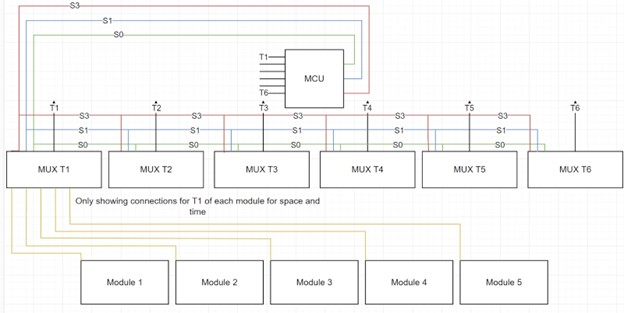

# Temp Sense Board Firmware Requirements

## Overview

The purpose of this board is to do 3 main things. On a loop, it needs to read a group of sensors, change the multiplexer channel, read the sensors again, until all of them have been read, and then send that data in 2 forms over CAN Bus, as well as have a safety output that will toggle if any of the sensors goes above the required safety value[^1].

There are 6 multiplexers. Each multiplexer is connected to 1 of the 6 temperature sensors in each module. So essentially, you have access to 1 sensor per module at any given moment. 

## Reading the Temperatures: Basic operation

1. Select Tn using the mux selector outputs from the MCU S0, S1, S2 (check the data sheet for how to do this) starting at n = 1
2. Using the ADC, sample the voltage (convert the ADC m-bit[^2] value to a voltage between 0 and 3.3v) for Tn for all 5 modules (M1 -> M5) and store each in its own respective variable. (you could do 5 arrays of size 6, where each array represents 1 module’s worth of temperature sensors’ raw values). 

3. Increment n and repeat steps 1 and 2 until all 6 Temperature sensor groups have been sampled and stored.
4. In another set of variables /arrays (depending on how you chose to do step 2), convert the raw values to a temperature value in degrees C.  You will want to check the datasheet for this, however I’m fairly certain with the way we have the sensor connected (no pull down on the output), 10.0 mV/°C is the conversion factor. 
5. Start again at N = 1

This only describes the very basic operation. If you have time, I’d also like a level of error checking. I.e perhaps a flag if a temperature sensor is out of range (short circuit case at least, this more your area of expertise than mine so idk how else you could check for some basic errors). 

## Communication with the BMS

Contrary to what we thought before, we aren’t allowed to just have an “ok” output from this board to the BMS, as for rules compliance as well as charging, the BMS needs to know at minimum, the highest and lowest temperature readings at any given moment. Because of how this board was designed, we don’t have the option to use the DAC to just give it the bare minimum info using the dedicated analog pins, so we have to use CAN and give it all the temperature data using the CAN protocol described by their thermistor expansion board such the BMS thinks we are using one of those.  

I’ve linked the CAN Protocol required [here](https://www.orionbms.com/downloads/misc/thermistor_module_canbus.pdf). There are specified transmit frequencies, but I’m not sure if they need to match accurately for this to work. If you think it would be too difficult to get it to work with roughly the right timing, you can try doing it after every cycle of N = 1 to N = 6 to start. Keep in mind that as I understand the document, **Thermistor General Broadcast** needs to cycle through every individual temperature value across all modules, whereas **Thermistor Module -> BMS Broadcast** would be the global min, max, and average temp values every time (along with the other required info outlined in the document).

There is 1 challenge which you may need to tackle (good luck), which is the **J1939 Address Claim Broadcast **message. I’m not sure if this is required for it to work correctly (I think there is a low chance it is required), but you may need to write the code to have the board follow the J1939 protocol. It seems to be some automotive device address protocol built on top of CAN that allows a device to declare itself. I found a [website ](https://copperhilltech.com/blog/sae-j1939-address-claim-procedure-sae-j193981-network-management/)that kind of explains how to use it, but do this step **after you get everything else to work first. **

## STM32U5 Nucleo pinout

Luckily for you I already did the hard work of figuring out which pin is what and wrote it all down (double check yourself, just in case):

<table>
  <tr>
   <td><strong>Signal Name</strong>
   </td>
   <td><strong>“Arduino” pin number</strong>
   </td>
   <td><strong>STM32 Pin number</strong>
   </td>
  </tr>
  <tr>
   <td>S0
   </td>
   <td>D7
   </td>
   <td>PF13
   </td>
  </tr>
  <tr>
   <td>S1
   </td>
   <td>D5
   </td>
   <td>PE11
   </td>
  </tr>
  <tr>
   <td>S2
   </td>
   <td>D2
   </td>
   <td>PF15
   </td>
  </tr>
  <tr>
   <td>T1
   </td>
   <td>A0
   </td>
   <td>PA3
   </td>
  </tr>
  <tr>
   <td>T2
   </td>
   <td>A1
   </td>
   <td>PA2
   </td>
  </tr>
  <tr>
   <td>T3
   </td>
   <td>A2
   </td>
   <td>PC3
   </td>
  </tr>
  <tr>
   <td>T4
   </td>
   <td>A3
   </td>
   <td>PB0
   </td>
  </tr>
  <tr>
   <td>T5
   </td>
   <td>A4
   </td>
   <td>PC1
   </td>
  </tr>
  <tr>
   <td>T6
   </td>
   <td>A5
   </td>
   <td>PC0
   </td>
  </tr>
  <tr>
   <td>CAN RX
   </td>
   <td>D67
   </td>
   <td>PD0
   </td>
  </tr>
  <tr>
   <td>CAN TX
   </td>
   <td>D66
   </td>
   <td>PD1
   </td>
  </tr>
  <tr>
   <td>Temp_OK
   </td>
   <td>D25
   </td>
   <td>PB4
   </td>
  </tr>
</table>

<!-- Footnotes themselves at the bottom. -->
## Notes

[^1]:
     You have to get the CAN communication with the BMS working correctly such that the BMS itself knows at least the Highest and lowest temperature cell. Without this it won’t meet the rule requirements, and won’t charge. More on the CAN protocol later, but the safety output is more of a backup. 

[^2]:

     Depending on how you set up the ADC m can be 8 to 14 bit so make sure to keep that in mind. Storing the ‘raw’ reading as a voltage will allow us to double check our work more easily. 
